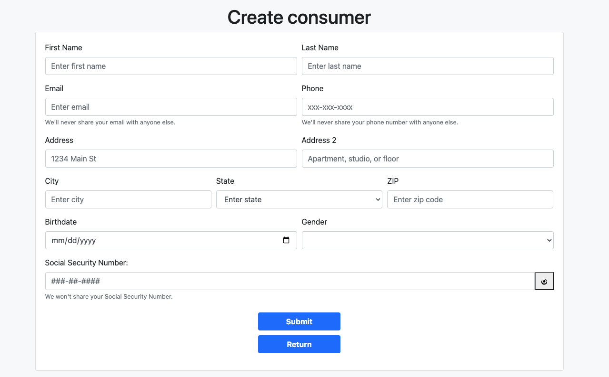
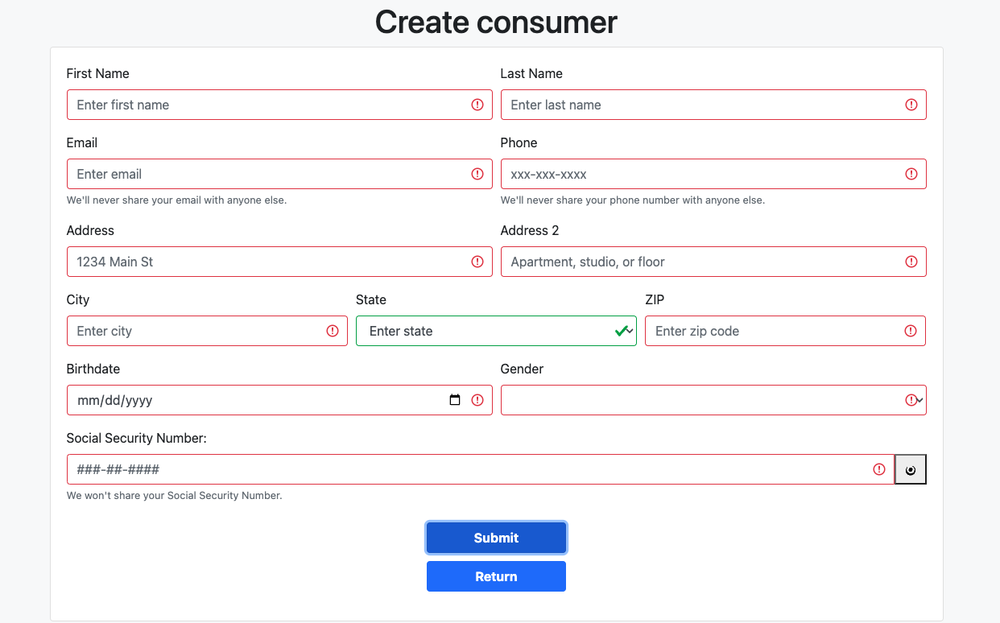
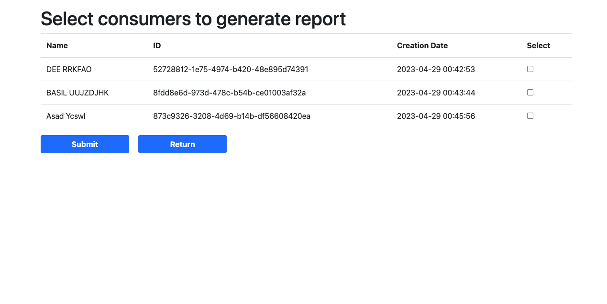

# Account Review Sample Application: Official Documentation

## Overview

The Account Review Sample Application illustrates the utilization of the Bloom Credit platform for conducting an account review inquiry. Before you can request an account review report, you must first register one or more consumers. Within the Bloom sandbox environment, it's advisable to work with recognized test consumers. Their names and social security numbers can be procured from your partnership liaison. Although you can register consumers not present in the sandbox environment, requesting data for them will yield a "no-hit".

Upon consumer registration, orders for account review reports can be placed by choosing one or more consumers from your registered list. The application then places the orders using the account review SKU, retrieves the reports through the GQL interface, and presents a summarized view of the data.

## Steps to Run the Sample

1. Adhere to the instructions in the [Setup section](https://github.com/bloomcredit/samples-data-access#setup).
2. Navigate to [Config](./config.py) and adjust `PORTFOLIO_ID` and `SKU` should you wish to examine the application with your specific dataset.
3. To activate the application, execute:

```bash
poetry run python run.py
```

> **Note**: The `SKU` for this application should be set to `VANTAGE`.

## Accessing the Application

Open a browser and navigate to `http://127.0.0.1:5001`.

Upon access, you'll be presented with the following form:


Here, you can register MULTIPLE consumers. Assuming you've already configured the `PORTFOLIO_ID` and `SKU`, the application will process the credit report for each of them:


In instances of incorrect format or omitted fields, errors will be highlighted in red:


After inputting all required details and clicking `submit`, the button will transition to `Loading...` (given that all fields pass validation).

Following a brief processing period, you'll encounter either a consumer creation `error` display or a success notification:


You can then opt to register `another consumer` or advance to `retrieve the report`:


At this juncture, select the desired consumers and hit submit:


Consequently, your comprehensive report will be made available:

