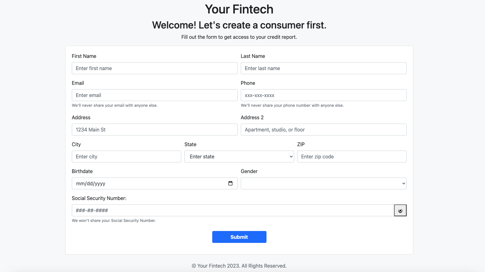
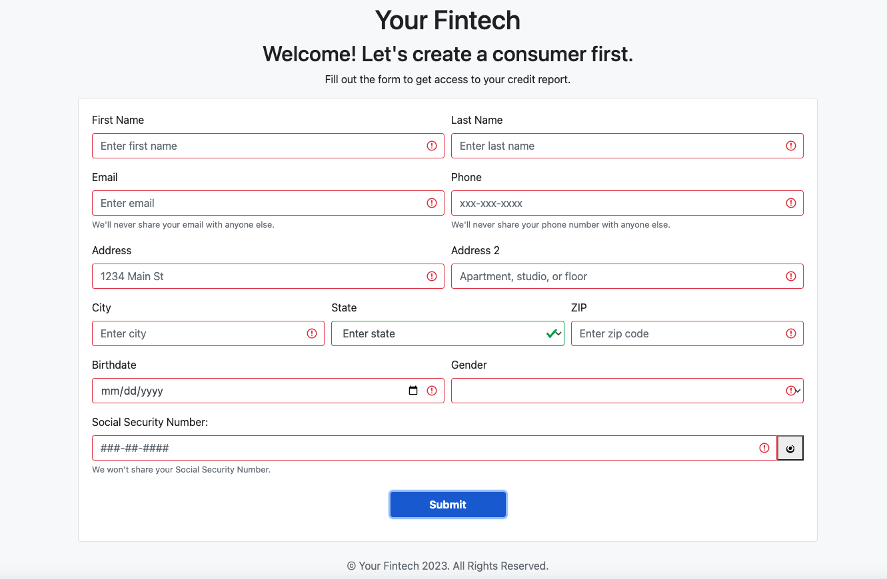
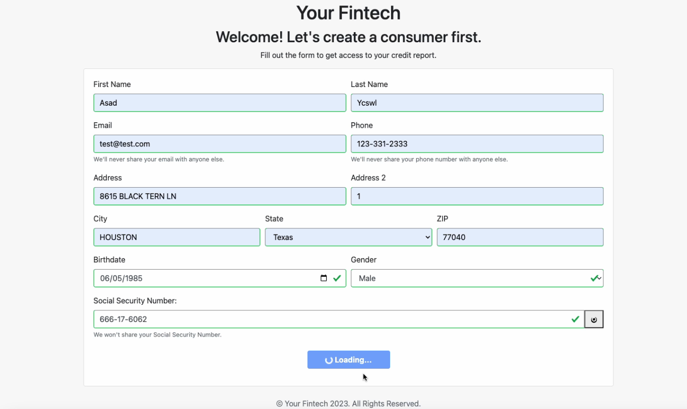
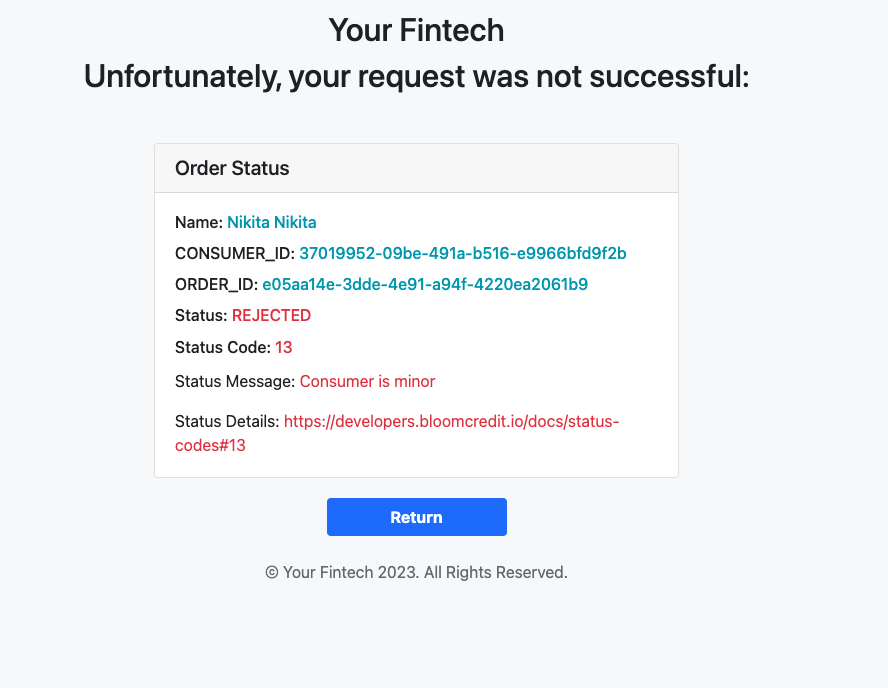
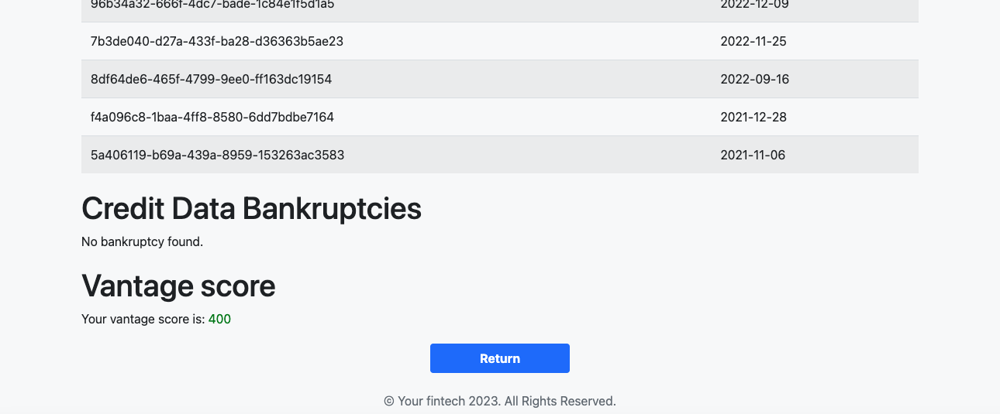

# Account Review Sample Application: Official Documentation

## Overview

The Account Review Sample Application is a blueprint illustrating the potential use of the Bloom Credit platform for conducting account review inquiries. Before commissioning an account review report, a mandatory step involves the registration of the consumer. Within Bloom's sandbox environment, it is advisable to register known test consumers. You can procure their names and social security numbers from your partnership liaison. It's worth noting that registering consumers not present in the sandbox will result in a "no-hit" when attempting to access their data.

Following consumer registration, account review orders can be placed. The application then proceeds to dispatch these orders using the dedicated account review SKU. Reports are subsequently retrieved via the GQL interface and a comprehensive summary comprising Credit Data Tradelines, Credit Data Inquiries, Credit Data Bankruptcies, and Vantage Score is presented.

## Steps to Run the Sample

1. Adhere to the instructions in the [Setup section](https://github.com/bloomcredit/samples-data-access#setup).
2. Navigate to [Config](./config.py) and adjust `PORTFOLIO_ID` and `SKU` should you wish to examine the application with your specific dataset.
3. To activate the application, execute:

```bash
poetry run python run.py
```

> **Note**: The `SKU` for this application should be set to `VANTAGE`.

## Accessing the Application

The application can be accessed at the URL `http://127.0.0.1:5001`.

Upon entry, the subsequent form is presented:


Within this interface, you're equipped to register a consumer. Assuming the `PORTFOLIO_ID` and `SKU` are pre-configured, the application is primed to process the credit report.

Should there be discrepancies in the data format or any inadvertent omissions, the corresponding fields will be flagged in red:


Once all mandatory fields are furnished and upon selecting `submit`, the interface will denote `Loading...`, signifying successful validation:


Post a brief data processing interval, a notification screen will either confirm a _successful_ transaction or notify of an _error_.

For reference, an **error** display is depicted here:


Conversely, the **success** interface appears as follows:


A visual walkthrough demonstrating the application's operational flow is available here:


For users with either a `silver` or `gold` SKU, an additional feature facilitates viewing the Vantage score at the conclusion of the process:


---
